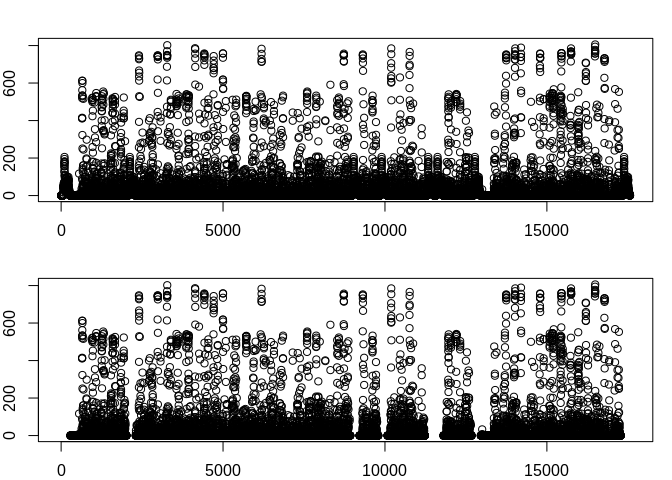

<br />


#### Loading and preprocessing the data ####

Loading the data for initial analysis.

```r
setwd("/home/cleiton/Desktop/RepData_PeerAssessment1/")
activity <- read.csv("./activity.csv", na.strings = "NA")
```

Seeing how the data looks.


```r
head(activity)
```

```
##   steps       date interval
## 1    NA 2012-10-01        0
## 2    NA 2012-10-01        5
## 3    NA 2012-10-01       10
## 4    NA 2012-10-01       15
## 5    NA 2012-10-01       20
## 6    NA 2012-10-01       25
```

By looking at the result of **head()**, we know there are some missing values in this dataset. Let's see what else we can find out.


```r
summary(activity)
```

```
##      steps                date          interval     
##  Min.   :  0.00   2012-10-01:  288   Min.   :   0.0  
##  1st Qu.:  0.00   2012-10-02:  288   1st Qu.: 588.8  
##  Median :  0.00   2012-10-03:  288   Median :1177.5  
##  Mean   : 37.38   2012-10-04:  288   Mean   :1177.5  
##  3rd Qu.: 12.00   2012-10-05:  288   3rd Qu.:1766.2  
##  Max.   :806.00   2012-10-06:  288   Max.   :2355.0  
##  NA's   :2304     (Other)   :15840
```

It's pretty interesting to know that just by running **summary()** you can discover a lot of important information.

- First, the most common value of steps is 0, the average is 37.38 and the maximum number of steps in one interval is 806.

- Second, the only variable that contains missing values is the variable **steps**, with 2304 NA's.

- Third, the maximum value of variable **interval** is 2355. What does not make sense to me, but we will discuss this later.


```r
str(activity)
```

```
## 'data.frame':	17568 obs. of  3 variables:
##  $ steps   : int  NA NA NA NA NA NA NA NA NA NA ...
##  $ date    : Factor w/ 61 levels "2012-10-01","2012-10-02",..: 1 1 1 1 1 1 1 1 1 1 ...
##  $ interval: int  0 5 10 15 20 25 30 35 40 45 ...
```
Based on the output of **str()** and **summary()**, we can make some more assumption.

- **date** is a *factor with 61 levels*, we saw in **summary()** that each of these levels has 288 observations, to make sure I will multiple 61*288 = 17568. 17568 is exactly the total number of observations in the activity dataset. In short, we can say that the number of observations taken each day was 288.

- Now we can ask ourselves. Are there any gaps in the variable **interval**?. We know that the spaces between these intervals is 5 minutes.


```r
unq <- unique(activity$interval);length(unq)
```

```
## [1] 288
```


```r
completeIntervals <- seq(0,2355,5);length(completeIntervals)
```

```
## [1] 472
```


```r
missingIntervals <- subset(completeIntervals,!(completeIntervals %in% unq)); length(missingIntervals)
```

```
## [1] 184
```
There are 288 observations in **interval** , which make sense, because we have 24 hours in a day and 288 pieces of 5 minutes is the same as 24 hours. What doesn't make sense is that there are some gaps in the observations when it should be continuous. Maybe because it was easier to process and take conclusions or maybe the measurements were not correctly taken, who knows!


```r
missingIntervals
```

```
##   [1]   60   65   70   75   80   85   90   95  160  165  170  175  180  185  190
##  [16]  195  260  265  270  275  280  285  290  295  360  365  370  375  380  385
##  [31]  390  395  460  465  470  475  480  485  490  495  560  565  570  575  580
##  [46]  585  590  595  660  665  670  675  680  685  690  695  760  765  770  775
##  [61]  780  785  790  795  860  865  870  875  880  885  890  895  960  965  970
##  [76]  975  980  985  990  995 1060 1065 1070 1075 1080 1085 1090 1095 1160 1165
##  [91] 1170 1175 1180 1185 1190 1195 1260 1265 1270 1275 1280 1285 1290 1295 1360
## [106] 1365 1370 1375 1380 1385 1390 1395 1460 1465 1470 1475 1480 1485 1490 1495
## [121] 1560 1565 1570 1575 1580 1585 1590 1595 1660 1665 1670 1675 1680 1685 1690
## [136] 1695 1760 1765 1770 1775 1780 1785 1790 1795 1860 1865 1870 1875 1880 1885
## [151] 1890 1895 1960 1965 1970 1975 1980 1985 1990 1995 2060 2065 2070 2075 2080
## [166] 2085 2090 2095 2160 2165 2170 2175 2180 2185 2190 2195 2260 2265 2270 2275
## [181] 2280 2285 2290 2295
```

<br />

#### What is mean total number of steps taken per day? ####

For this part of the assignment, we are going to ignore the missing values in the dataset.

First, let's use tapply to calculate the total number of steps taken per day.


```r
totalSteps <- with(activity,(tapply(steps, date, sum, na.rm = TRUE)))
```

If we plot an histogram we can make some sense of the data.


```r
hist(totalSteps, col = "blue", density = 50, xlab = "Total Steps", main = "Total steps per day", ylim = c(0,30))
```

<!-- -->

According to the plot, the most frequent number of the the total of steps taken per interval are around 10k and 15k steps, followed by 0 and 5k. Besides, the mean e median might be next of each other, since there are no outliers. 


```r
mean(totalSteps)
```

```
## [1] 9354.23
```

```r
median(totalSteps)
```

```
## [1] 10395
```

There we are!.

<br />

#### What is the average daily activity pattern? ####

Regarding this question, we need to find how many steps in average were taken across all days and the maximum value from these average values.


```r
intervalMean <- with(activity,(tapply(steps, interval, mean, na.rm = TRUE))) 
df_intervalMean <- data.frame(interval = as.numeric(names(intervalMean)), steps = intervalMean)
```


```r
library(ggplot2)
g <- ggplot(df_intervalMean, aes(interval, steps))
mytheme <- theme(plot.title = element_text(colour = "darkblue", hjust = 0.5, size = 15, family = "arialblack"))
g + geom_line(size = 0.6) + theme_bw() + labs(title = "Average number of steps per interval") + mytheme
```

<!-- -->


```r
intervalMean[intervalMean == max(intervalMean)]
```

```
##      835 
## 206.1698
```
What's the maximum number of steps from these average values?

**Answer:** 206 Steps

<br />

#### Imputing missing values ####

Note that there are a number of days/intervals where there are missing values (coded as \color{red}{\verb|NA|}NA). The presence of missing days may introduce bias into some calculations or summaries of the data.


```r
sum(is.na(activity$steps));mean(is.na(activity$steps))
```

```
## [1] 2304
```

```
## [1] 0.1311475
```

There are 2304 observations with NA's values, which correspond to 13% of the dataset. Are these missing values interfering with the analysis?.For the sake of our analysis, let's fill in all of the missing values in the dataset. We can do it by changing the NA's values for the interval mean value across all dates. 

I do not want to mess with the activity dataset, so I will create a second one called activity2. sorry my lack of creativity!.


```r
activity2 <- activity # creating a new dataset
df_intMean <- data.frame(interval = as.numeric(names(intervalMean)), steps = intervalMean)

cnt <- 0  # creating a variable to track changes
comparison <- 0

for (i in seq_along(activity2$steps)){ 
  
  cnt <- cnt+1 #counter
  
    if(is.na(activity2[i,1]) == TRUE){
    a <- df_intMean[which(df_intMean$interval == activity2[i,3]),]
    activity2[i,1] <- as.integer(a$steps)
    
    comparison <- c(comparison,cnt) 
  }
}
```

To see how our changes have effect the data, nothing better then plotting the data.


```r
par(mfrow = c(2,1), mar = c(2,2,2,1),oma = c(0,0,0,0))
plot(activity2$steps, ylab = "Steps")
plot(activity$steps)
```

<!-- -->

Impressive, ins't it? We have dealt with the missing values without compromissing the integrity of the data.

Do you remember our first histogram? If not, let us refresh your memory and compare with a new one. 


```r
totalSteps2 <- with(activity2,(tapply(steps, date, sum, na.rm = TRUE)))
par(mfrow = c(2,1))
hist(totalSteps, col = "blue", density = 50, xlab = "Total Steps", main = "Total steps per day (with Missing values)", ylim = c(0,30))
hist(totalSteps2, col = "purple", density = 50, xlab = "Total Steps", main = "Total steps per day (without missing values)", ylim = c(0,30))
```

<!-- -->

It seems that all this work payed off!, now we have a much smooth dataset and the values are better distributed.


```r
mean(totalSteps2);median(totalSteps2)
```

```
## [1] 10749.77
```

```
## [1] 10641
```

The mean and median are much closer than before, which take shape of an unimodal histogram rather than a bimodal. There are not big differences between the previous data, except that by introducing the median values in the missing values we ended up increasing the number of steps uniformely across the dataset.

<br />

#### Are there differences in activity patterns between weekdays and weekends? ####

We can start by creating a new variable to identify which day of the week the date was collected. 


```r
library(lubridate) # data manipulation library 
```

```r
activity2_date <- activity2
activity2_date$date <- ymd(activity2$date) #transforming the variable date in a Date format.
activity2_date$weekdays <- weekdays(activity2_date$date)
unique(activity2_date$weekdays)
```

```
## [1] "segunda" "terça"   "quarta"  "quinta"  "sexta"   "sábado"  "domingo"
```

**Obs:** Once again, I do not want to mess with the last dataset, so I created a new one called **activity2_date**.

Separating the weekends.


```r
my_condition <- which(activity2_date$weekdays == "sábado" | activity2_date$weekdays == "domingo")
activity2_weekends <- activity2_date[my_condition,]
unique(activity2_weekends$weekdays)
```

```
## [1] "sábado"  "domingo"
```

**Obs:** My apologies, the weekdays is in my mother tongue "portuguese". However, *Segunda, Terça, Quarta, Quinta, Sexta, Sábado, Domingo* are respectively *Monday, Tuesday, Wednesday, Thursday, Friday, Saturday and Sunday".* 

Now that I have separeted the weekends from the data, I will take its mean by using **tapply()**.


```r
activity2_weekends_mean <- with(activity2_weekends, tapply(activity2_weekends$steps, activity2_weekends$interval, mean))
activity2_weekends_names <- names(activity2_weekends_mean)
unique(activity2_weekends$weekends)
```

```
## NULL
```

Let's do the same for the weekdays.


```r
activity2_weekdays <- activity2_date[-my_condition,] # select all data except the weekends
unique(activity2_weekdays$weekdays)
```

```
## [1] "segunda" "terça"   "quarta"  "quinta"  "sexta"
```

```r
activity2_weekdays_mean <- with(activity2_weekdays,tapply(activity2_weekdays$steps, activity2_weekdays$interval, mean)) # taking its mean
activity2_weekdays_names <- names(activity2_weekdays_mean)
```

Finally, plotting the data.


```r
par(mfrow = c(2,1), oma = c(2,0,0,0), mar = c(1,4,1,2))
plot(activity2_weekdays_names,activity2_weekdays_mean, type = "l", xlab = "", ylab = "Steps", main = "Weekday", xaxt = "none", ylim = c(0,250))
plot(activity2_weekends_names,activity2_weekends_mean, type = "l", xlab = "Interval", ylab = "Steps", main = "Weekend", ylim = c(0,250))
```

<!-- -->

If I were to create a story about this data , I would say that during the week this person slept around 8 hours, woke up and did some chores, went jogging and had a very active day at work, returning home to chill. Nonetheless, the peak was during an especific time of the morning. 

Similarly, during the weekend this same person wakes up latter, do these routine tasks much more slower - Hey, there is no need to rush, it's Saturday/Sunday! - then does much more activities of lesser intensity during all day, probably trying to enjoy the entire day. Finally, she goes home to watch some netflix.


```r
summary(activity2_weekdays_mean)
```

```
##    Min. 1st Qu.  Median    Mean 3rd Qu.    Max. 
##   0.000   2.156  25.700  35.553  50.806 230.356
```

```r
summary(activity2_weekends_mean)
```

```
##    Min. 1st Qu.  Median    Mean 3rd Qu.    Max. 
##   0.000   1.188  32.312  42.312  74.594 166.625
```

In addition, some numbers to back my theory up. 

<br />
<br />
<br />
<br />
